# Clinic Appointment Reminder Service

---

## 1. Application Overview

The service manages clinic appointments and sends automated reminders to patients before their scheduled time. Clinic staff create and manage appointments through an admin dashboard. Patients and doctors receive email and SMS notifications at three intervals: 24 hours, 2 hours, and 30 minutes before the appointment.

Missing appointments costs clinics revenue and leaves patients without care. The reminder service directly affects that outcome, which is why reliability matters here.

**Cloud: AWS (ca-central-1)**

AWS is the choice for compliance tooling (HIPAA-eligible services, KMS, CloudTrail) and for keeping patient data in Canada under provincial privacy law. ca-central-1 is the natural region for a Canadian clinic product.

**Staff dashboard — clinic admin view**

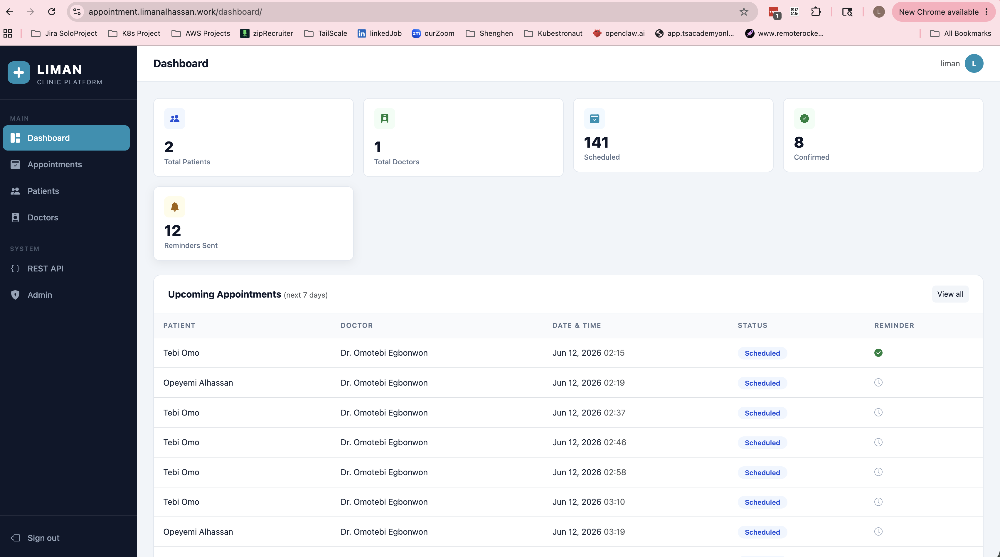

**Patient view**

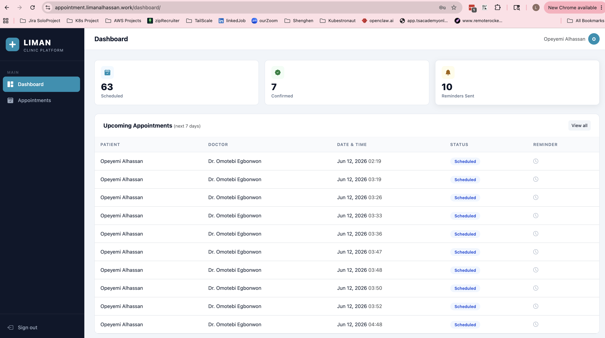

**Django admin — appointments, doctors, patients**

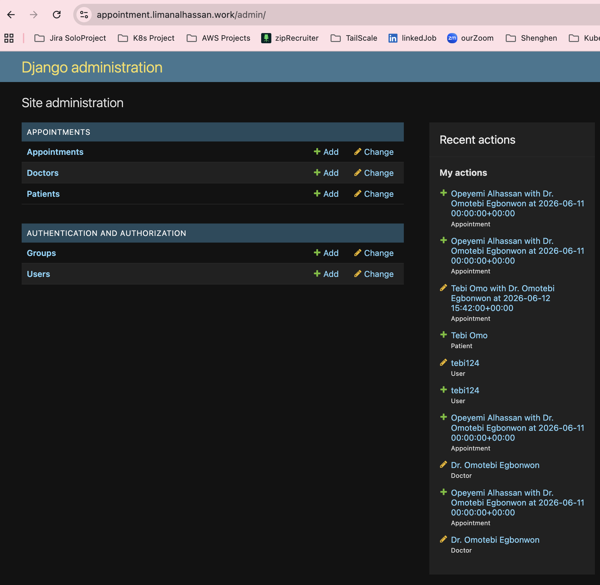

**Stack**

| Layer | Technology |
|---|---|
| Framework | Django + Django REST Framework |
| Background jobs | Celery with AWS SQS as broker |
| Database | PostgreSQL on RDS |
| Notifications | AWS SES (email) + AWS SNS (SMS) |
| Container | Docker |
| Orchestration | EKS |

**Uptime target: 99.9%**

If the web tier goes down, staff cannot book or modify appointments. If the worker goes down, reminders stop. A patient who misses an appointment because no reminder arrived is a real harm. The 15-minute beat interval means a brief restart is tolerable, but extended worker downtime during business hours is not.

**Notifications delivered to patients and doctors**

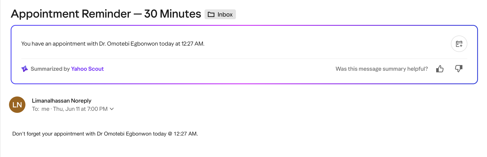

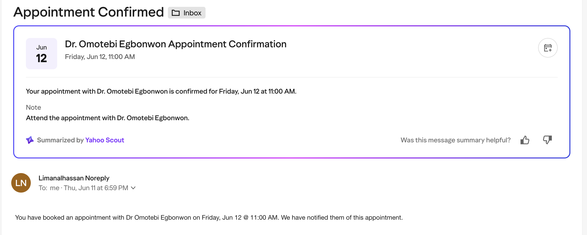

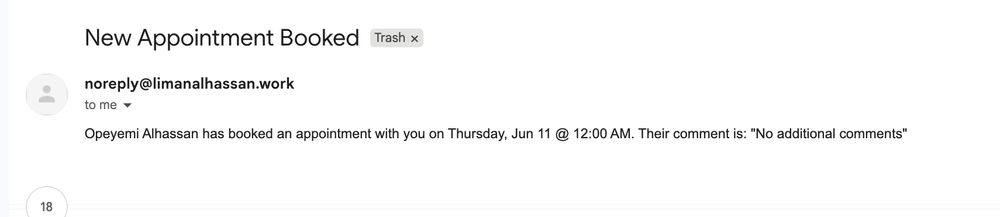

**Key health metrics**

- HTTP 5xx rate on the web tier
- SQS queue depth between beat cycles
- Reminder tasks dispatched per beat tick
- RDS connection count and query latency
- Pod restart count

---

## 2. Infrastructure Design

### Architecture

```
Internet
   |
   v
ALB (HTTPS, ACM cert)
   |
   v
EKS (private subnets, ca-central-1a + ca-central-1b)
   |
   +-- clinic-web Deployment       <- HPA: scale on CPU > 70%
   |
   +-- clinic-worker Deployment    <- KEDA: scale on SQS depth / 10
   |
   +-- clinic-beat Deployment      <- single pod, fires every 15 min
   |
   +-- clinic-migrate Job          <- runs before each rollout
   |
   v
RDS PostgreSQL (Multi-AZ, private subnet)
   ^
   |
SQS (clinic-tasks queue)
```

### Networking

Single VPC across two availability zones.

```
VPC  10.5.0.0/16
 |
 +-- public1   10.5.1.0/24   ca-central-1a   ALB, NAT gateway
 +-- public2   10.5.2.0/24   ca-central-1b   ALB
 +-- private1  10.5.10.0/24  ca-central-1a   EKS nodes, RDS
 +-- private2  10.5.20.0/24  ca-central-1b   EKS nodes, RDS
```

EKS nodes and RDS run in private subnets with no public IPs. The ALB sits in the public subnets and is the only entry point for external traffic. Outbound traffic from private subnets routes through a NAT gateway in public1. Security groups restrict RDS to connections from EKS node CIDRs only.

### Packaging and Delivery

The application is containerised with Docker and packaged as a versioned Helm chart. Two separate CI pipelines handle this:

```
Push to application/
  -> build Docker image, push to ECR
  -> commit updated image tag to argocd_application/values/clinic/values.yaml
  -> ArgoCD detects change and deploys

Push to helm/
  -> bump chart version, push chart to GHCR
  -> commit updated targetRevision to clinic-app.yaml
  -> ArgoCD detects change and syncs
```

**ArgoCD managing all cluster applications**

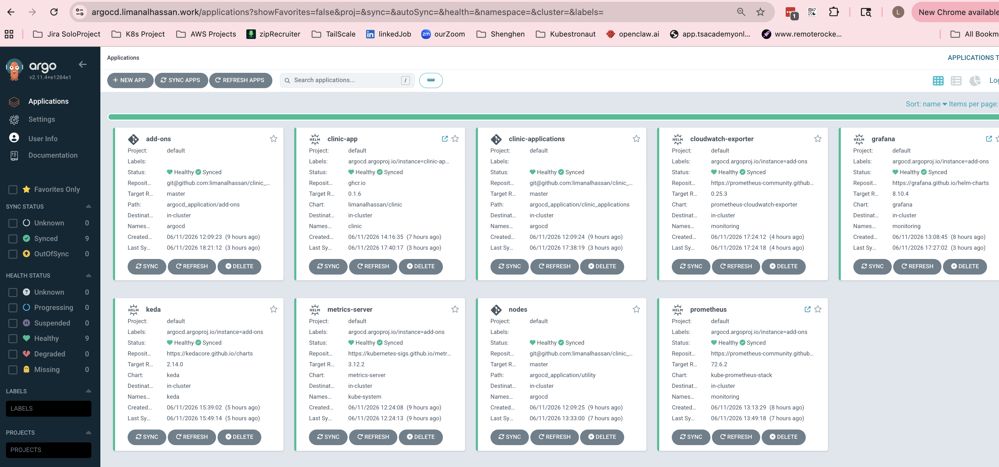

ArgoCD manages all cluster state. Every environment-specific value lives in `argocd_application/values/clinic/values.yaml`, not in the chart itself. The chart stays generic and reusable.

**DNS records in Cloudflare pointing to the ALB**

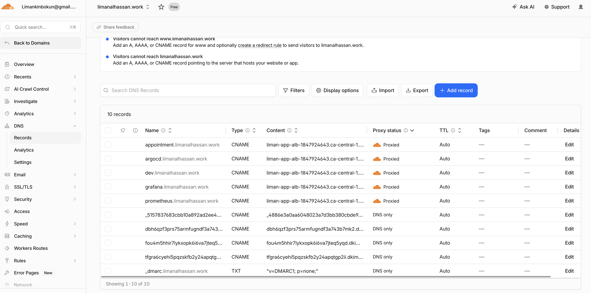

### HTTP Traffic and SSL

The AWS Load Balancer Controller provisions an ALB from the Kubernetes Ingress resource. ACM handles the TLS certificate for `appointment.limanalhassan.work`. SSL terminates at the ALB. Traffic flows:

```
Internet -> ALB port 443 (TLS) -> EKS pods port 8000 (HTTP)
```

### Component Sizing

| Component | CPU request | CPU limit | Memory request | Memory limit |
|---|---|---|---|---|
| web | 250m | 500m | 256Mi | 512Mi |
| worker | 250m | 500m | 256Mi | 512Mi |
| beat | 100m | 250m | 128Mi | 256Mi |

These are conservative starting values tuned for a Django application under moderate load. The HPA adjusts web replica count before individual pod limits become a constraint.

### Supporting Systems

**Secrets management:** Application secrets (database password, Django `SECRET_KEY`, SES credentials) are stored in a Kubernetes Secret (`clinic-app-secret`) created manually via `kubectl`. The secret name is referenced in the Helm chart so it is never stored in Git or Helm values.

**IAM:** EKS Pod Identity binds Kubernetes service accounts to IAM roles. Pods access SQS, SES, SNS, and CloudWatch without static credentials.

**No CDN or app-level cache:** The application serves API responses and a lightweight dashboard. There are no static assets worth fronting with CloudFront at this stage. SQS replaces Redis as the Celery broker, removing a stateful cache tier that would otherwise run 24/7.

### Metrics and Logging

`django-prometheus` exposes application metrics at `/metrics`. A Prometheus ServiceMonitor scrapes it every 30 seconds. A CloudWatch exporter adds SQS queue depth and RDS metrics. Grafana dashboards aggregate both sources.

Logs are available via `kubectl logs`. For a regulated production deployment these would ship to CloudWatch Logs.

### How the Design Meets the Uptime Target

- Two web replicas as a minimum, HPA scales to 10
- EKS nodes span two availability zones, RDS is Multi-AZ
- If one AZ is lost, the ALB routes to the surviving AZ automatically
- Beat is single-instance but stateless: a restart costs at most one 15-minute tick

### Cost Optimisation

**KEDA** scales the Celery worker from 1 to 10 based on SQS queue depth. During off-hours the worker sits at its minimum replica consuming almost no CPU. At peak load it scales to match demand and scales back down when the queue drains.

**EKS Auto Mode (Karpenter)** manages node provisioning. Nodes are added when pods are pending and removed when capacity is idle. Combined with KEDA, the cluster runs at minimum footprint outside business hours with no manual intervention.

SQS as the Celery broker removes the need for a Redis instance entirely, saving the cost of a 24/7 ElastiCache node.

---

## 3. Observability, Operations, and Incident Response

### Four Golden Signals

| Signal | Source | Metric |
|---|---|---|
| Latency | django-prometheus | `django_http_requests_latency_seconds` p95 |
| Traffic | django-prometheus | `django_http_requests_total` by endpoint |
| Errors | django-prometheus | HTTP 4xx/5xx from `django_http_responses_total_by_status` |
| Saturation | KEDA + HPA | SQS `ApproximateNumberOfMessages`, pod CPU % |

### Dashboard

**Cluster resource utilisation — pod, CPU, and memory requested**

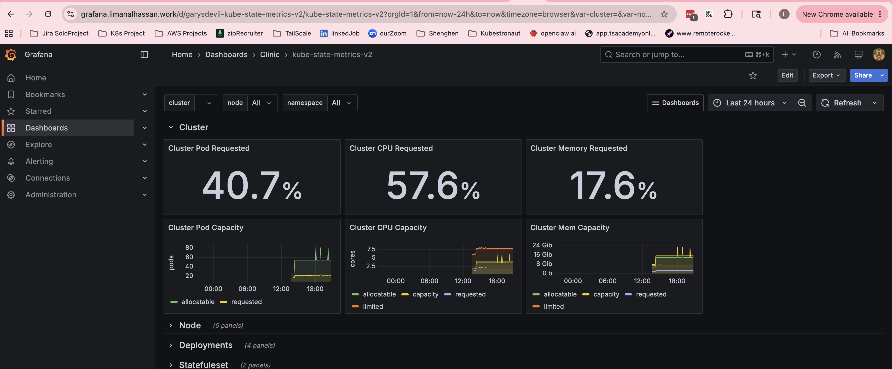

**Node and pod health**

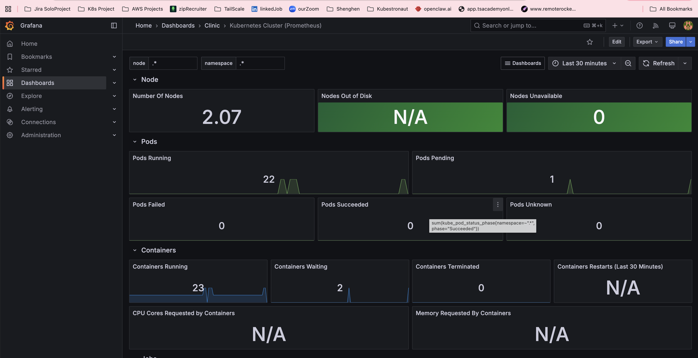

**Deployment replica tracking**

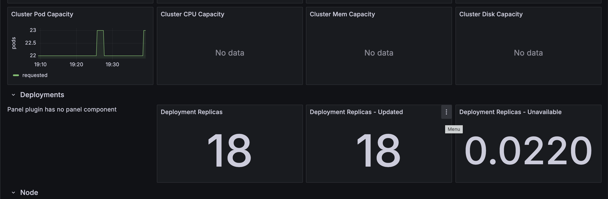

The Grafana dashboard covers:

- Request rate and error rate (web tier health at a glance)
- p95 response latency (are users seeing slow responses?)
- SQS queue depth over time (is the worker keeping up?)
- Active worker replicas (is KEDA scaling as expected?)
- RDS connections and CPU (is the database a bottleneck?)
- Pod restart count (anything crashing silently?)

RDS CPU and pod restarts were specifically included because they are the two most common early warning signs in Django deployments.

### Automated Responses

| Trigger | Response |
|---|---|
| Web pod CPU > 70% | HPA scales web Deployment (2 to 10 replicas) |
| SQS messages / 10 > current workers | KEDA scales worker Deployment (1 to 10 replicas) |
| Pod fails liveness probe 3 times | Kubernetes restarts the pod |
| Pods pending due to insufficient nodes | Karpenter provisions a new node within 60 seconds |

### On-Call Thresholds

| Condition | Threshold | Reasoning |
|---|---|---|
| HTTP 5xx rate | > 1% for 5 minutes | Beyond transient noise; users are hitting real errors |
| p95 latency | > 2 seconds for 5 minutes | The dashboard and API feel broken to users |
| SQS queue depth | > 500 messages for 15 minutes | Worker not draining; reminders will arrive late |
| No `dispatch_reminders` task in 20 minutes | beat pod is down |
| RDS CPU | > 80% for 10 minutes | Database approaching saturation |

### Day-to-Day Maintenance

ArgoCD self-heals and manages deployments. KEDA and HPA handle scaling without intervention. Regular tasks are minimal:

- Check RDS storage headroom (set a CloudWatch alarm at 80% disk used)
- Review SES sending quota if message volume grows significantly
- Rotate secrets in AWS Secrets Manager on a schedule (ExternalSecrets picks up new values on the next pod restart)

### Handling a Traffic Spike

A spike hits the ALB, which distributes across existing web pods. If CPU climbs above 70%, the HPA adds pods within 30 to 60 seconds. If the SQS queue builds, KEDA adds workers in the same window. If there is no node capacity for new pods, Karpenter provisions a node in under a minute. The main delay in a fast ramp is ALB target group registration for new pods, which takes 15 to 30 seconds.

### Incident Response

```
1. Open Grafana. Identify which golden signal is outside normal range and when it started.

2. Check pod state:
   kubectl get pods -n clinic

3. Check logs for the affected component:
   kubectl logs -n clinic deploy/clinic-web
   kubectl logs -n clinic deploy/clinic-worker
   kubectl logs -n clinic deploy/clinic-beat

4. If the database is suspect, check RDS CPU and connections in CloudWatch.

5. If the queue is building, check whether KEDA has scaled workers
   and whether worker logs show errors.

6. If a bad deploy caused the issue, roll back:
   Revert targetRevision in argocd_application/clinic_applications/clinic-app.yaml
   Commit and push. ArgoCD applies the rollback within seconds.
```

---

## 4. Deploying Version 2

Version 2 includes a new language runtime, updated framework libraries, new application code, and backward-compatible database schema changes. No maintenance window is required.

### Infrastructure Features That Help

**Migration Job with sync ordering:** The Helm chart runs `python manage.py migrate` as a Kubernetes Job before any new pods start. If the migration fails, the Job fails, ArgoCD halts the sync, and the existing v1 pods keep running unaffected.

**Versioned Helm charts on GHCR:** Chart version and image tag are tracked independently. Rolling back means changing one value in `clinic-app.yaml` and committing.

**Rolling deployment:** EKS replaces pods one at a time. Old v1 pods continue handling traffic until new v2 pods pass readiness checks. Because the schema is backward compatible, v1 and v2 pods can run against the same database simultaneously during the transition.

### Deployment Steps

```
1. Merge v2 code to master

2. CI builds the Docker image and pushes to ECR
   CI commits the new image tag to argocd_application/values/clinic/values.yaml

3. If the Helm chart changed:
   helm-publish bumps the chart version, pushes to GHCR,
   commits updated targetRevision to clinic-app.yaml

4. ArgoCD detects the updated values file
   Runs the clinic-migrate Job first (sync wave -1)
   Migration succeeds

5. ArgoCD begins the rolling deploy
   New v2 pods start, pass readiness checks, begin taking traffic
   Old v1 pods are terminated one at a time

6. Monitor during rollout:
   kubectl rollout status deploy/clinic-web -n clinic
   Watch Grafana error rate panel for any spike
```

### Why No Maintenance Window

The schema changes are backward compatible. Old v1 pods and new v2 pods can both read and write the database correctly during the rollout. The migration runs before any new pods start, and existing pods continue working against the updated schema without modification.

### Risks to Manage

- If the migration Job fails, investigate with `kubectl logs -n clinic job/clinic-migrate`. Fix the issue and re-push. The failed Job is replaced on the next sync.
- Monitor HTTP 5xx rate during the rollout. If it spikes, revert `targetRevision` to the previous chart version and commit. ArgoCD rolls back within seconds.
- Confirm with the engineering team that no new `NOT NULL` columns without defaults were added. Those would break v1 pods reading the updated schema during the transition window.
- The new language runtime carries more risk than the schema changes. Test the new image in a staging environment and confirm the application starts clean before merging to master.
